## Exercise 1: Create the Azure Resources
In this exercise, you will use the Azure Portal to create the resources needed for the other labs: a Web App, SQL DB, Key Vault, Storage and VNet. We'll also create an AAD group to manage users with.

1. Go to the [Azure Portal](https://portal.azure.com) and sign into your Azure account

### Create a Web App
For the purpose of this lab, we will use a S1 Standard pricing tier App Service Plan - you can try another type but the results may differ. This is the lowest level recommended for production workloads.
1. In the Azure Portal, click on the Create a resource button in the upper left corner of the page and select **Web App**
2. Give your web app a **unique name**, **choose your subscription** and **create a new Resource Group** to use with all the resources we'll create today like *gab2019hol-rg*

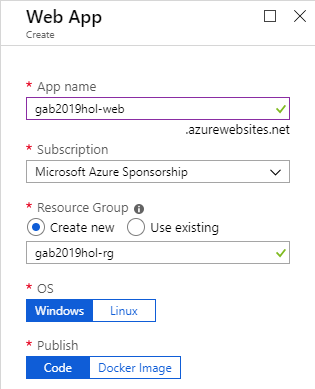

3. Click on the **App Service plan/Location** and click the **Create New button** Then give your **App Service Plan a name** and **choose a location** near you and **click OK**

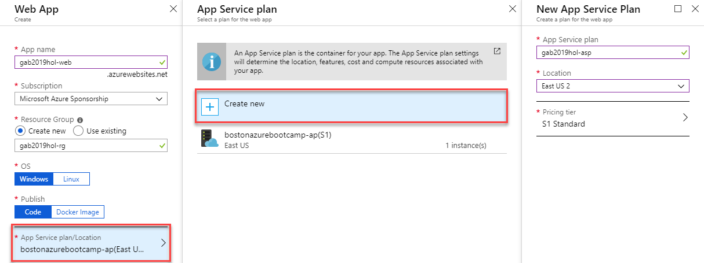

4. Now click the **Create button** to start the creation of the Web App.

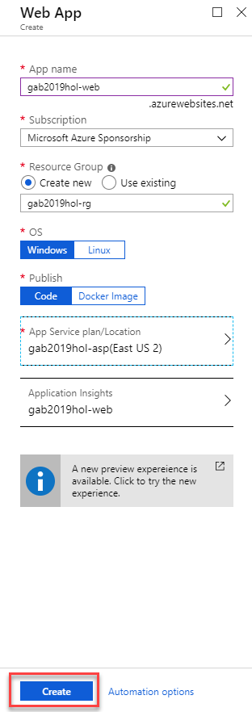

We'll come back to the Web App soon, but now let's create the database.

### Create a SQL DB
This lab creates a new S0 SQL database but you could choose another pricing level if you wish.
1. In the Azure Portal, click on the Create a resource button in the upper left corner of the page and select **SQL Database**
2. Select your **subsription** and the **resource group** you created in the last exercise.

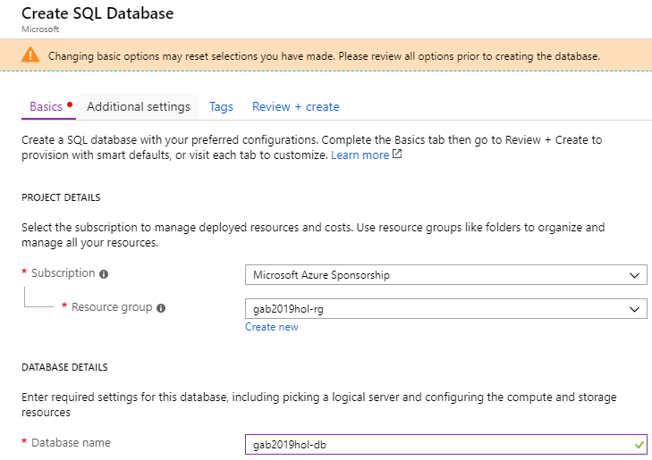

3. Click on the **Create new** link to create a new server, this will open the **New Server blade** from the right side of the screen. Give your server a **unique name**, set a server admin **login name** and **password** and make sure you select the **same location as your web app**. Click **Select**.

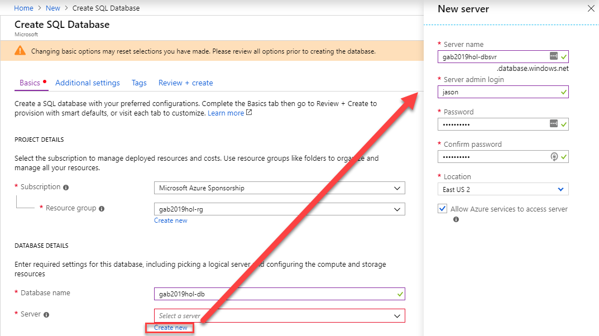

4. You can now leave the other settings to their default and click the **Review + create** button.

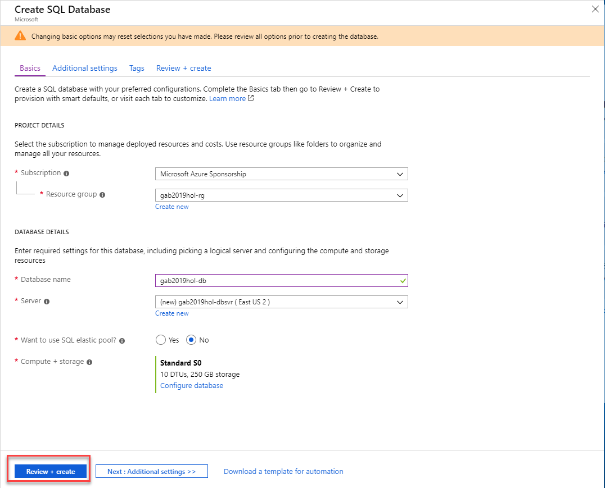

This will take you to the Review + create view that shows the cost and the details of what is going to be created.

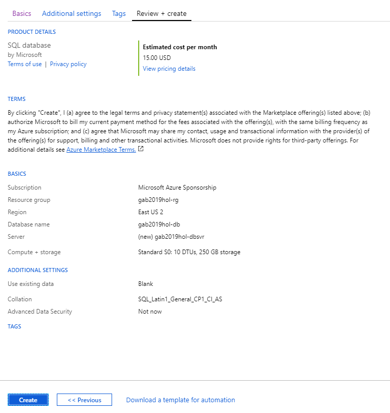

6. Click **Create** to start the creation of the SQL Database and server.

### Create a Key Vault
The next resource we'll create is a Key Vault.
1. In the Azure Portal, click on the Create a resource button in the upper left corner of the page and type **Key Vault** into the search box and hit enter. Then select create from the Key Vault information page. 

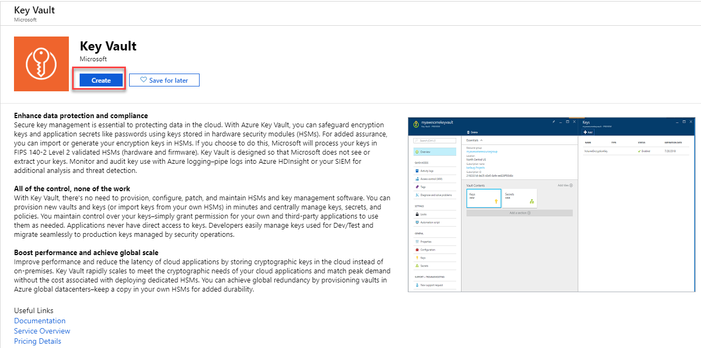

This takes you to the Create Key Vault blade.

2. Give your key vault a **unique name**, select the **subscription** and the **same resource group you have been using** for this lab and **location**. 

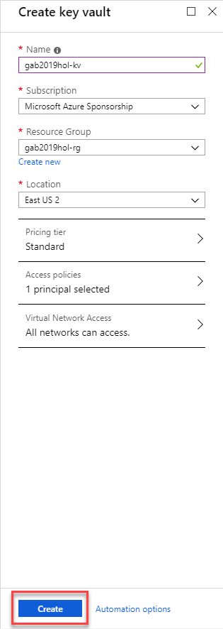

3. Click the **Create button** at the bottom to have the Key Vault craeted.

### Create a Storage account
1. In the Azure Portal, click on the Create a resource button in the upper left corner of the page and select **Storage account**

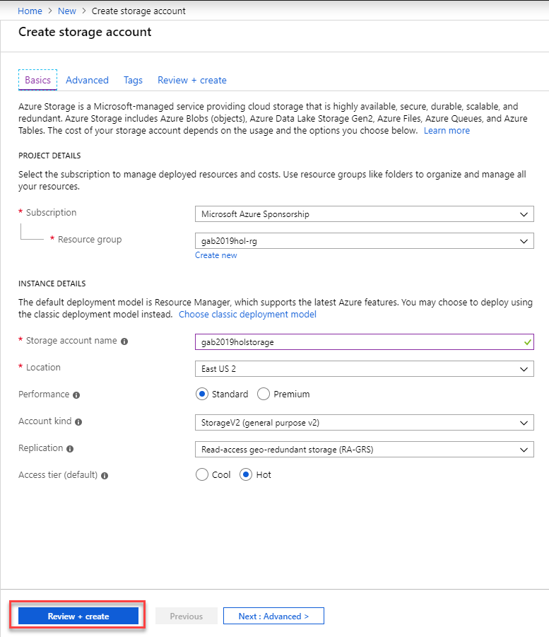

This opens the **Create storage account** view

2. Select your **subscription**, the same **resource group you have been using** and give the storage account a **unique name** and the same **location** you are using for the other resources. Click the **Review + create** button.

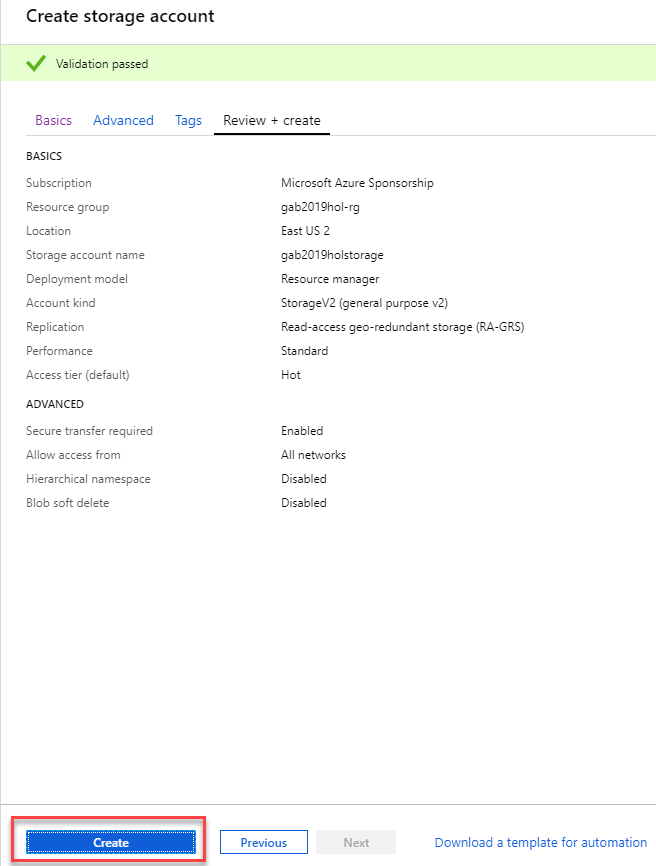

This shows you the summary of what will be created.

3. Click **Create** to have the storage account created.

### Create an AAD Group
In order to work with AAD users and Managed Identity with resources, it is easier to create a group to add both users and any Managed Identity service principles we need to. So now, let's create a group and put your user in it.
1. In the Azure Portal, find the search box in the middle of the header and type **Azure Active Directory** and choose it in the search result.

2. Select **Groups** 

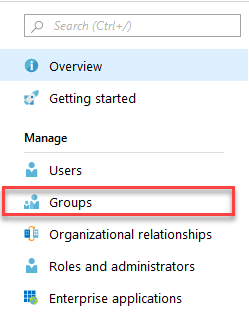

3. Click the **+ New group** button.

This will open the Group blade.

4. Select **Security** for the group type, give the **group a name** and for membership type select **Assigned**. Click on the **Members** button to add members.

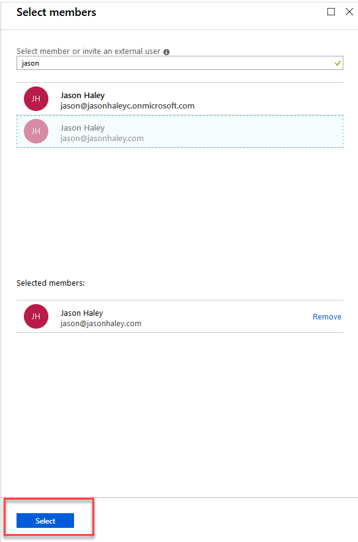

5. Find **your user** in the drop down and **select it**. The click 
the **Select** button.

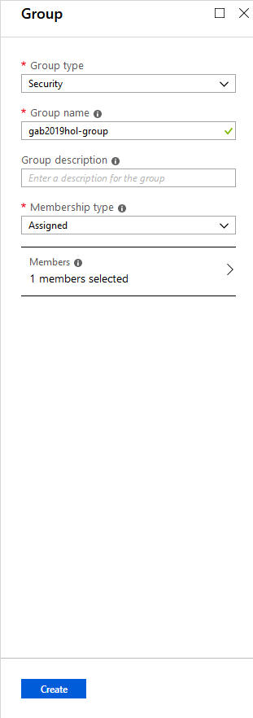

6. Select **Create** to have the group created.

Now that we have all the resources created, we can get the code and setup the local development scenario.
