## Exercise 2: Setup lab content and local development
In this exercise we'll add some demo data to the Key Vault, Storage and SQL DB. While adding the demo data, we'll get the local development environment working too.

### Get the code
1. The source code for the lab is on Github at: [SecuringWebAppsLab](https://github.com/JasonHaley/SecuringWebAppsLab) or copy this url for cloning [https://github.com/JasonHaley/SecuringWebAppsLab.git](https://github.com/JasonHaley/SecuringWebAppsLab.git)
2. Open a File Explorer on your machine and create a directory named **gab2019** and open that directory.
3. Next, open a command line at that directory or type "**cmd .**" in the address line of your file explorer

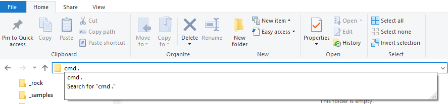

4. Clone the Github repo by typing the following:
`git clone https://github.com/JasonHaley/SecuringWebAppsLab.git`

This will pull the git repo with the sample web application and other files to your local machine.

### Add a Secret to Key Vault for the lab
In order to test the interaction with Key Vault, we'll need to put a secret in it to verify the web application can successfull retrieve secrets.

I recommend pinning your resource group to the dashboard so you can find all the resources quickly.

1. In the Azure portal, click on the **Resource Groups** menu item, then **search for your resource group** and **click the pin** in the upper right corner.

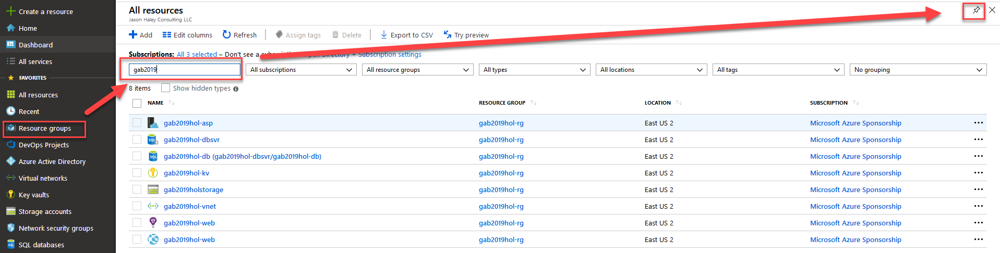

Now you should have all the relevant resources easily availble on the dashboard.

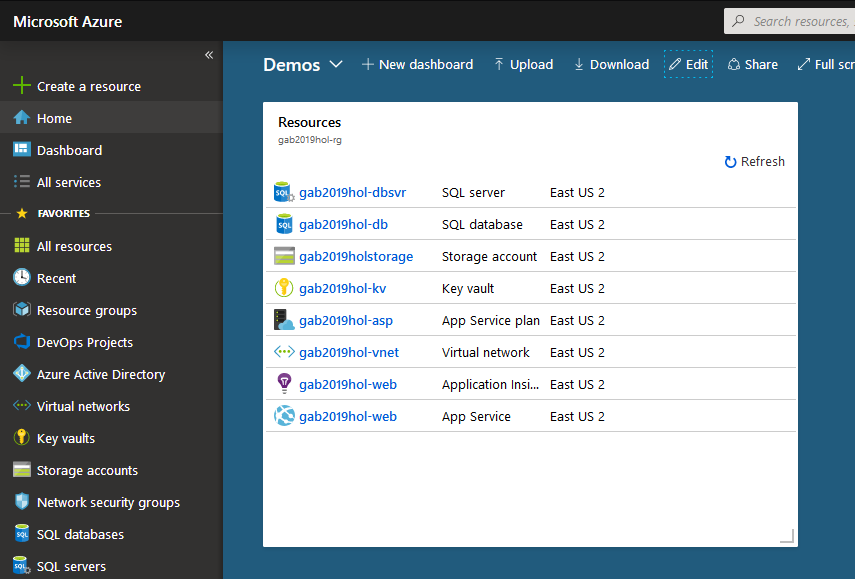

2. Open the Key Vault you created earlier, select **Secrets** and **+ Generate/Import**

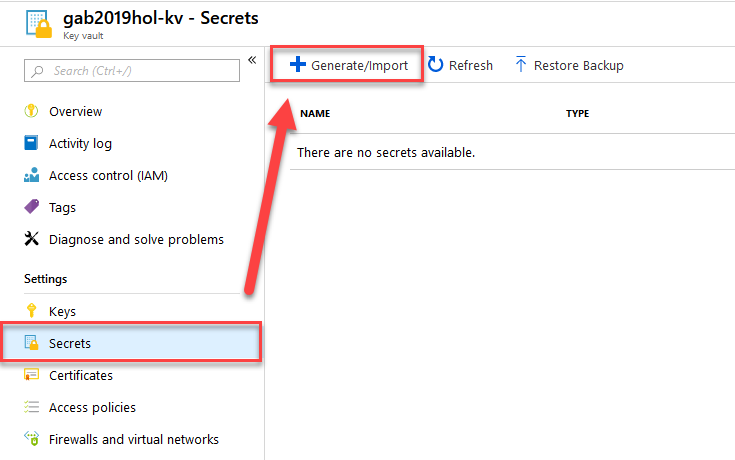

This opens the **Create a Secret** view.

3. Give you key the name of **Lab--KeyVaultSecret** and a value of whatever you want as the secret value and click **Create**.

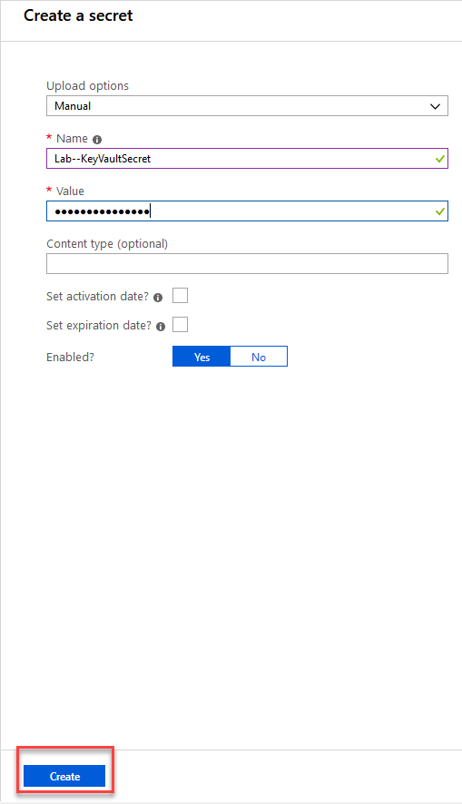

> A note about the name:
> The sample website uses a configuration provider that reads in the secrets and changes any "--" to ":" to fit with the syntax .NET Core already works with.

Before leaving the Azure Key Vault, let's give that AAD group access to the secrets.

4. Select **Access policies** in the menu and click **+ Add New**

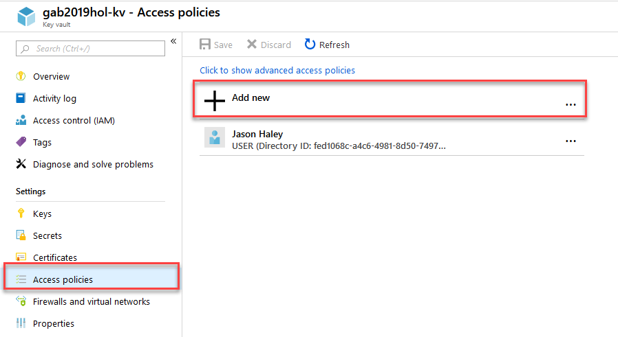

5. Select **Secret Management** from the template options. Click on the **Select principal** button and search for the AAD group you created and select it. Click the **Select** button at the bottom of the blade. Then click **OK**.

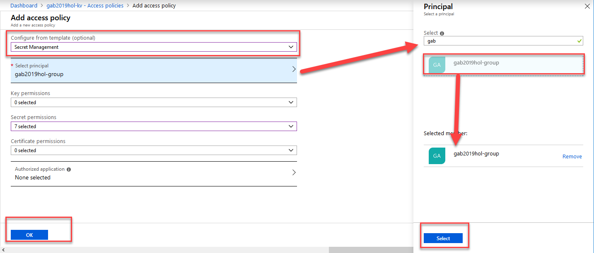

6. You should now see the group added, click the **Save** button.

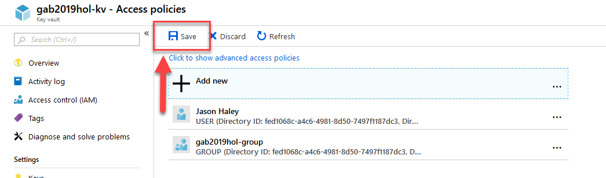

### Add a Container and Test File to Storage
The sample application looks for a blob in Azure Storage and reads the contents of the file and displays it on a web page in order to prove the site can interact with Storage. So let's add a file for the site to read.

1. Open the storage account you created earlier. If you are using the resoure groups from the dashboard the links should be off to the left:

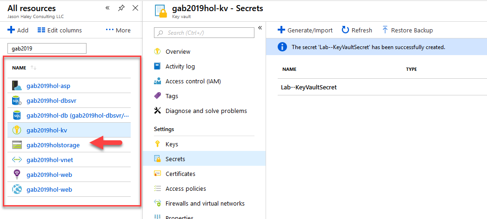

2. On the storage view, click on the **Blobs** link

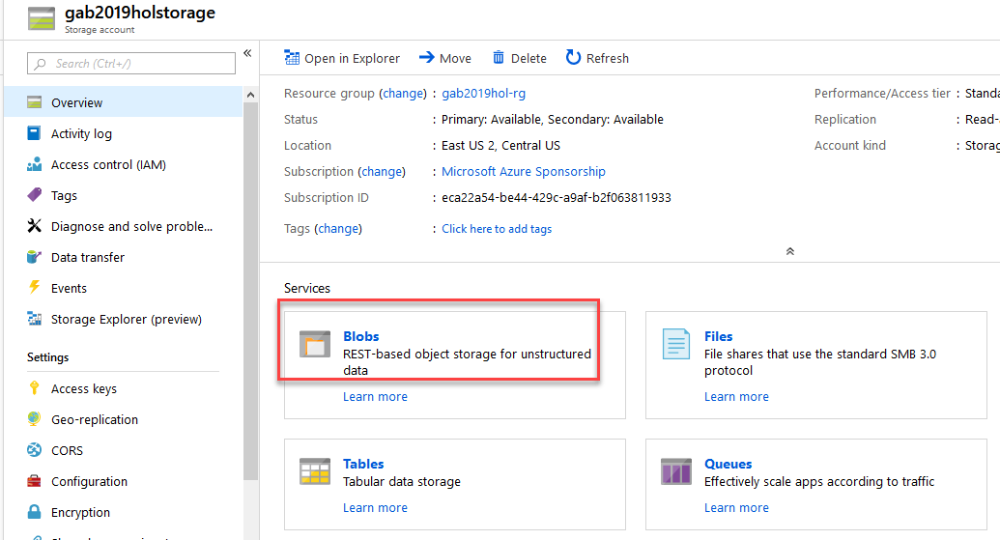

3. Click on the **+ Container** button to create a container, give it the name of **test** and click **OK**.

This will create a container for use to put a test file in.

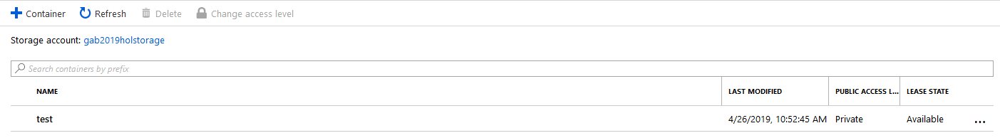

4. In the container listing click on the **test** container. Click the **Upload** button. This opens the **Upload blob** blade from the right. Click on the **file folder button**, navigate to where you cloned the git repo and under the /SecuringWebAppsLab/misc folder there is a **hello.txt** file. **Select it** and click the **Open** button on the dialog. Then click the **Upload** button

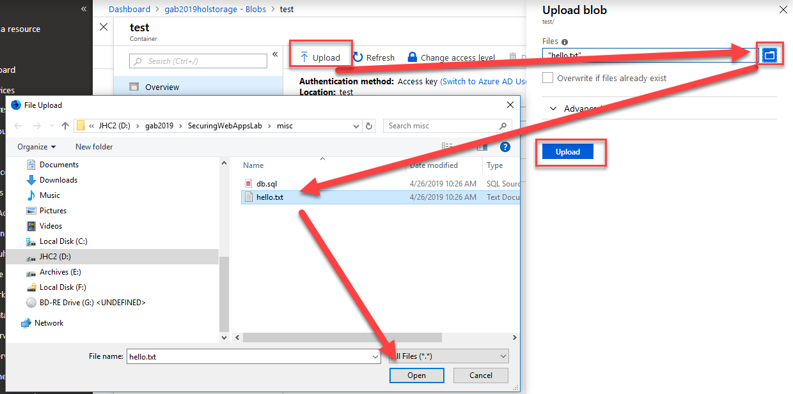

Once it is uploaded it will show in the listing.

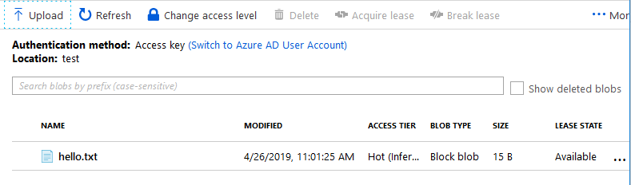

While we are in storage, we need configure access for reading the blob.

## Configure Storage Access Control
Since we will be using Azure Active Directory for interacting with Storage and not the shared keys, we need to add a role assignment.

1. Go to the **Access Control** view and select **Add a role assignment**.

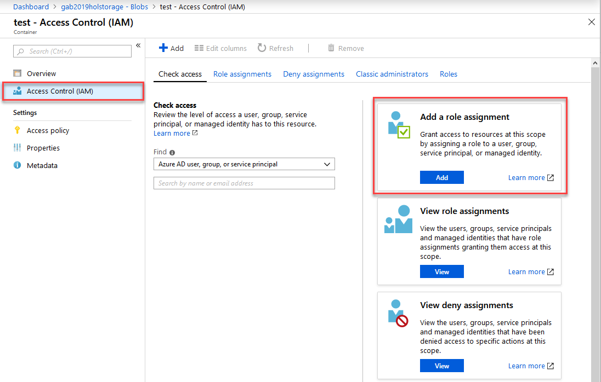

2. Select **Storage Blob Data Contributor** for the Role and search for the **group you created earlier** and select it, then click **Save**.

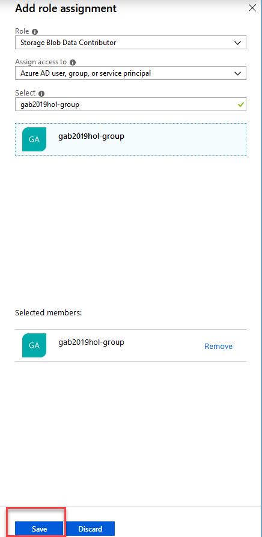

That is it for storage, now we need to setup the database.

## Configure SQL Database for AAD
In this lab, I'm working with the assumption that you have full rights to the resources we working with in Azure but not the group you created earlier. So in order to work with the database, we will first add your AAD account to the database.

1. Back on your dashboard, go to the database server you created - not the database. I named my server with "-dbsvr" on the end so I could tell the difference.

2. On the menu select **Active Directory admin** and click the **Set Admin** button

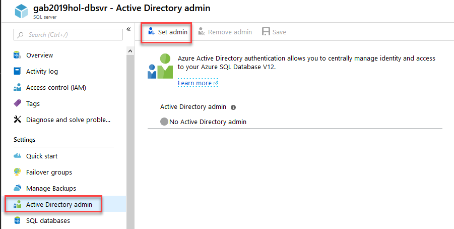

3. Search and **select your user name** and click the **Select** button at the bottom.

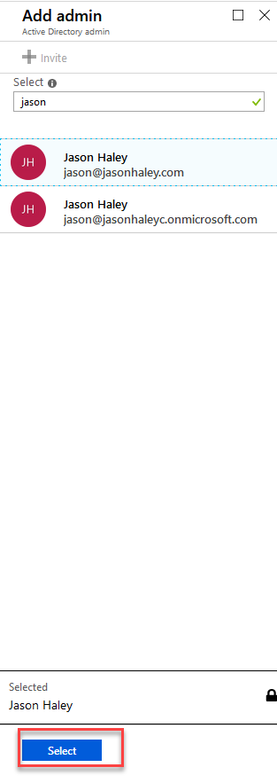

4. You should now see your admin added. Now click the **Save** button. Don't forget to click the Save button!

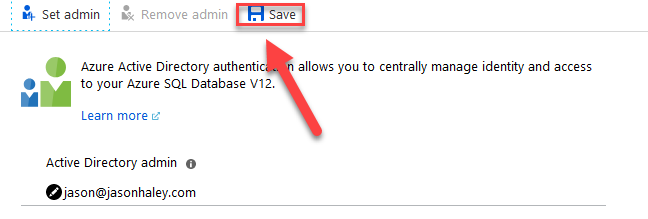

One last thing we need to do in order to run the code locally is to add your current IP address to the firewall.

5. On the menu, select **Firewalls and virtual networks**, then the **+ Add Client IP** button. This will add your IP address for you to the list. Now click the **Save** button.

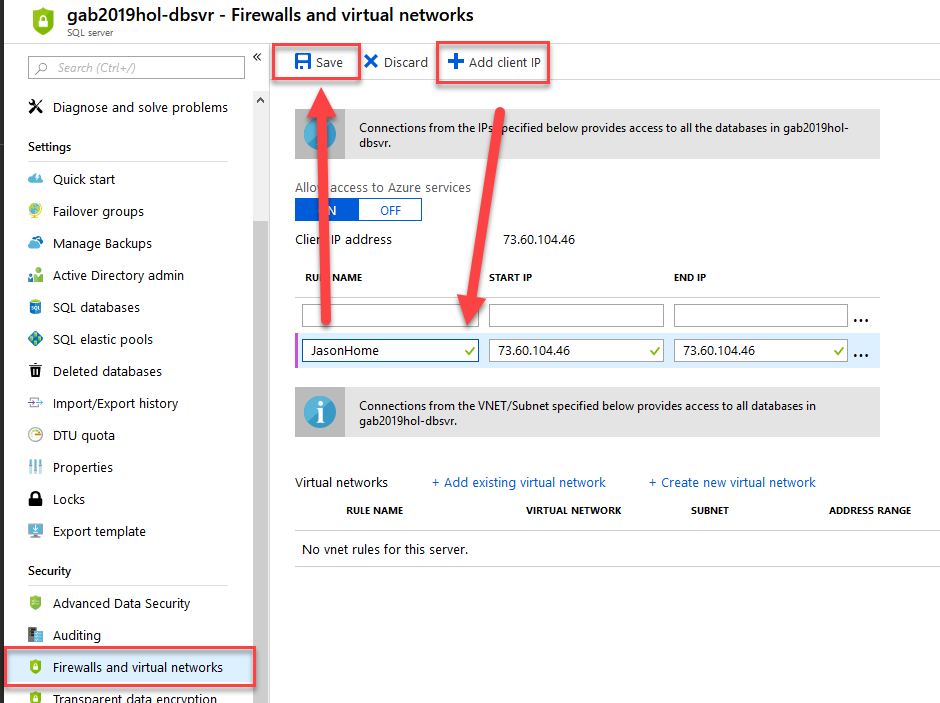

Now we need to add a table and some data.

## Add a Database Table with Sample data
We just need a simple table with some rows - nothing fancy.

1. Back on your dashboard, go to your database. In the menu select the **Query editor (preview)** then the **OK** button to utilize the AAD sign-in

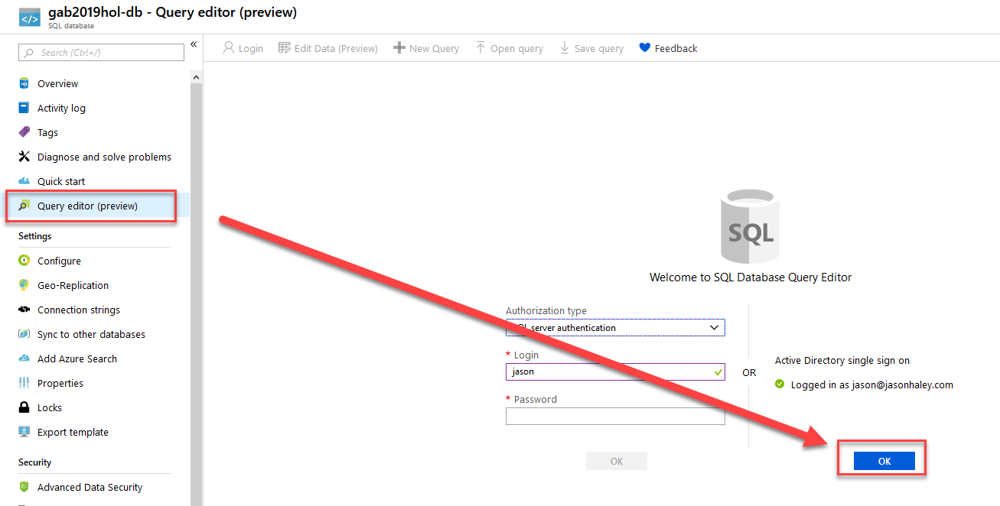

2. In the **Query editor** menu, select Open query and navigate to the gab2019/SecuringWebAppsLab/misc and select the **db.sql** file. Click **Open** on the dialog to load the sql.

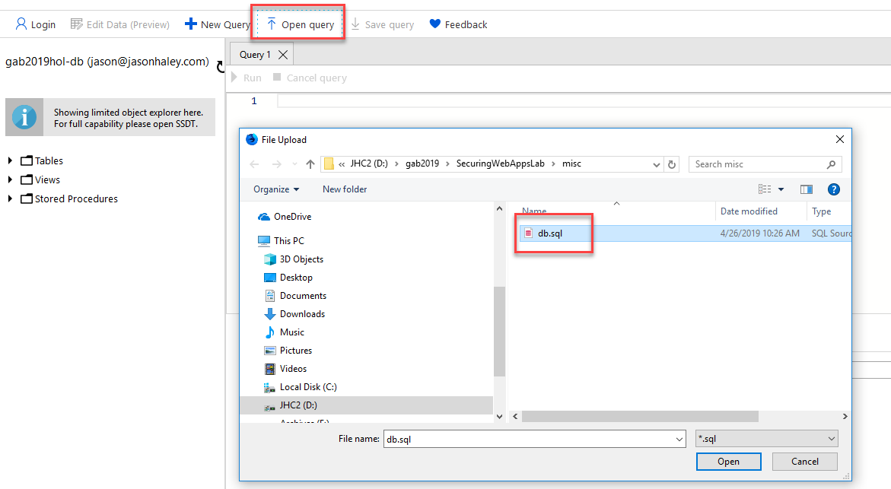

3. On **line 14 and 15**, **change the group name** to the AAD group you created in Exercise 1, then run the sql by clicking the **Run** button.

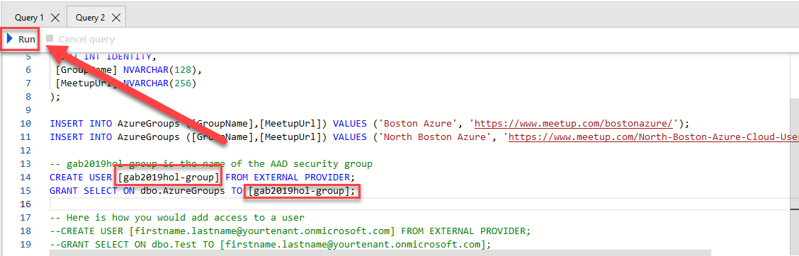

You now have the Azure resources ready to setup and test locally.

## Get up and running locally
Now its time to open it in Visual Studio.

1. Go back to your File Explorer and location the SecureWebApps.sln file and open it in Visual Studio.

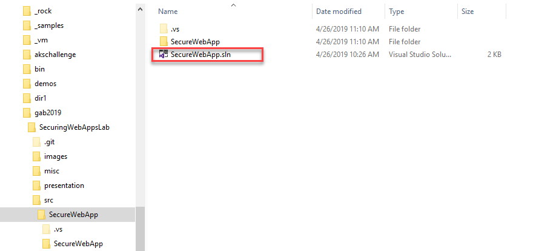

2. Once you have the project open, open the **appsettings.json** file.
Replace the KeyVaultBaseUrl, StoargeAccountName and replace the server and database names in the SqlConnectionString for your resources.

Notice there are no shared keys, username and passwords! This is a realy motivating factor to use Managed Identity.

3. Once you have replaced the settings with your values, start the debugger (F5).

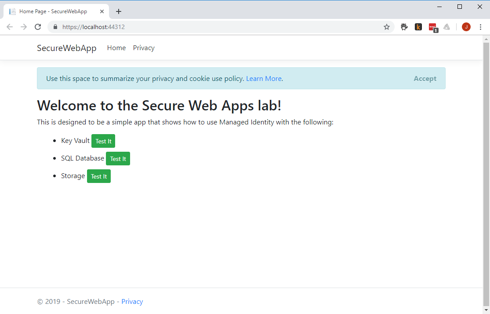

The test application should now run locally and you should be able to navigate through the buttons and see the different Azure resources being access without any shared secrets or passwords being sent to them!
