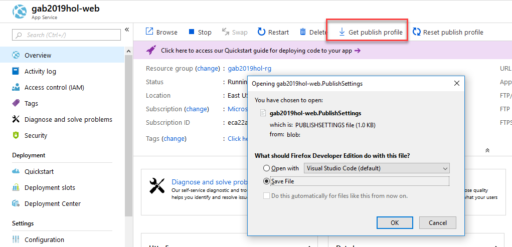
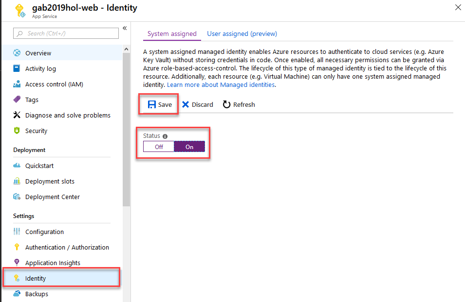
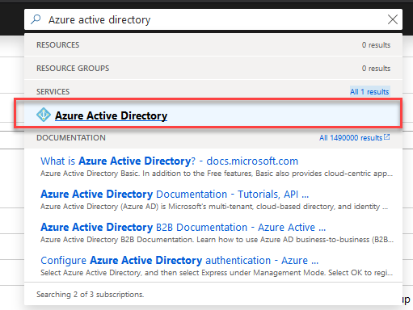
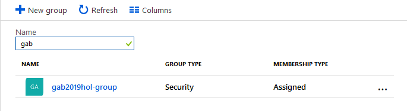
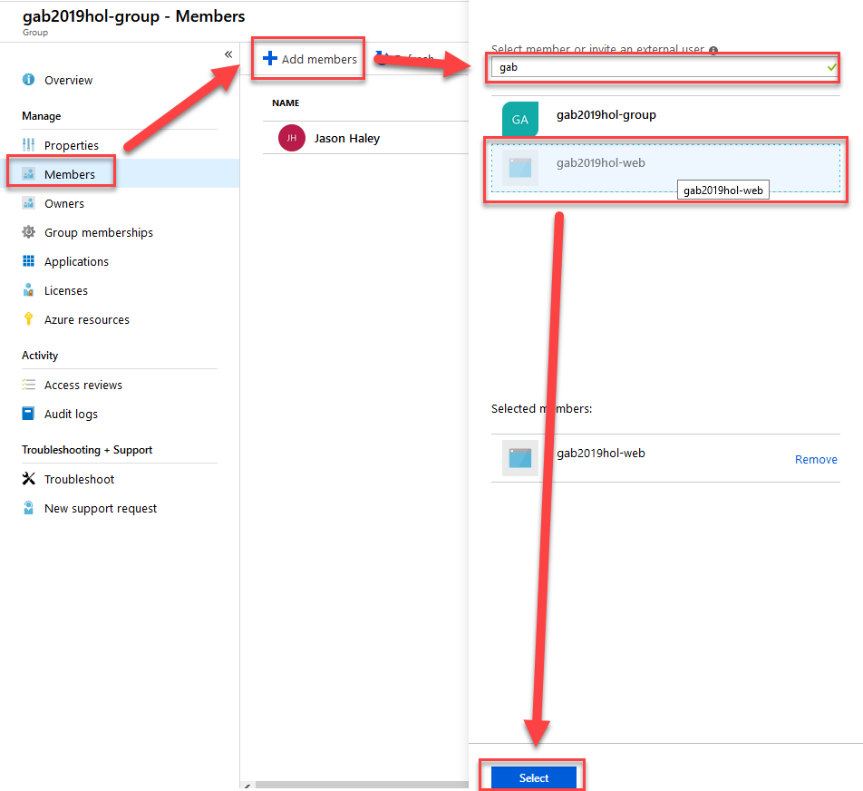
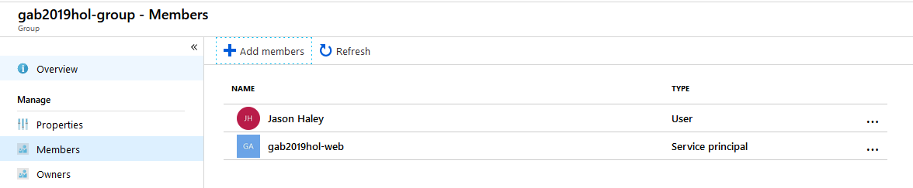
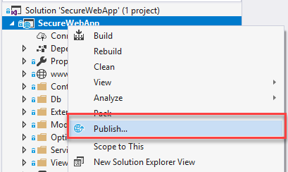
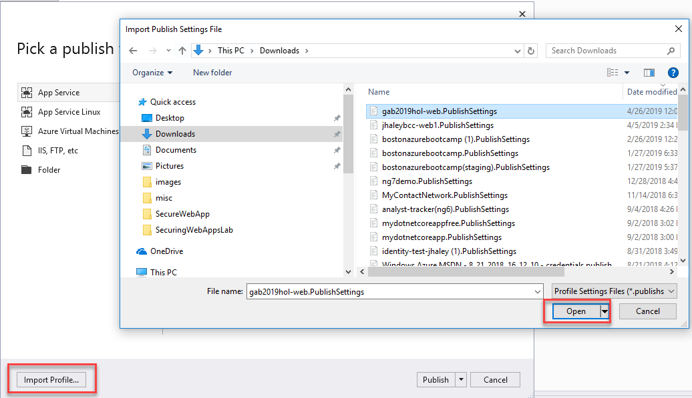
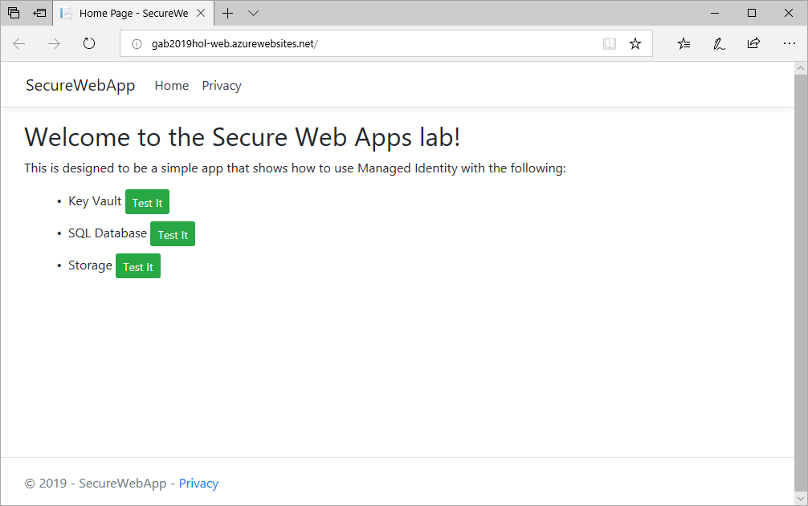

## Exercise 3: Deploy to Azure Web Apps and Enable Managed Identity
In this exercise you will deploy the web application to Azure and configure it to work with Managed Identity.

1. In the Azure portal, navigate to the Web App you created and click on the **Get publish profile** button and save the file to your machine.

Before deploying the application, let's turn on the Managed Identity and add it to the AAD group.

2. Find **Identity** on the menu, on the **System Assigned** tab, turn the **Status On** and click **Save** and **OK** to the confirmaton.

This will create the identity for the web application. Next we need to add that identity to the AAD group.

3. In the search box in top center, type **Azure Active Directory** and choose it in the search result.

4. Select **Groups** and search for the group you created

5. Select the **Members** menu, then click the **+ Add Members** button, search for your **web app name**, select it and click the **Select** button.

If you click the Refersh button, you should now see the AAD group has your user and the Web Application's Managed Identity in it.

2. Back in Visual Studio, in the Solution Explorer **right click on the SecureWebApp project** and select **Publish**.

This will open the Pick a publish target dialog.

3. Click the **Import Profile** at the bottom left of the dialog and **select the PublishSettings file** you just downloaded. Click **Open** - this will start the publish.

The web app should open in a browser once it has been deployed.

Verify all the buttons work before moving on.
