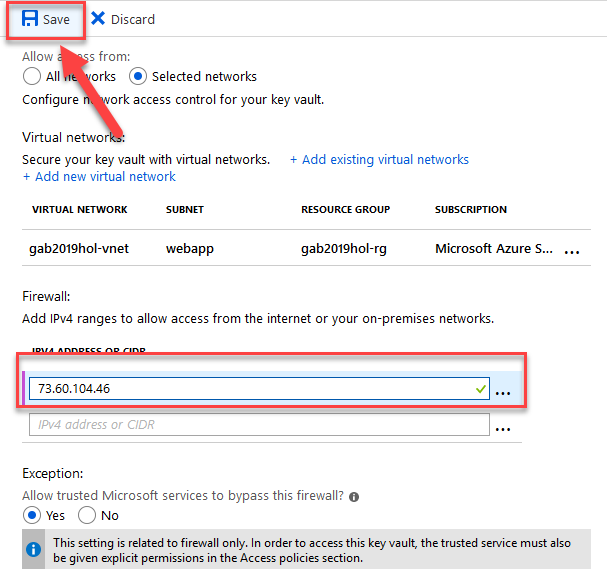

## Exercise 4: Configure VNet Integration
With a web application running in Azure, we now want to use a VNet to control traffic to the database, key vault and storage.

### Configure the Subnet
1. In the portal, navigate to the **virtual network** you created. On the menu, select **Subnets** and click the **+ Subnet button** at the top.

2. Give your subnet a **name**, in the Service endpoints list select: **Microsoft.KeyVault**, **Microsoft.Sql** and **Microsoft.Storage**. In the Subnet delegation, select **Microsoft.Web/serverFarms**. Click **Ok**.

Now our web app can have a whole subnet to itself. Next thing to do is connect the web app to the VNet.

### Enable VNet Integration in Web App
1. In the portal, navigate to the **web app** you created. On the menu, select **Networking** and then under the VNet Integration section click on the **click here to configure** link.

2. On the VNet Integration view, click the **Add VNet (preview)** button. Then on the **Network Feature Status** blade on the right, select your **network** and **subnet** you just created for the webapp. Click **Ok**.

Once this is done, you will be able to see the subnet address space listed at the bottom of the VNet Configuration view. This means the Web App can now communicate with resources on the VNet. 

Next we need to configure the other ends of those Service Endpoints we enabled on the subnet.

### Configure SQL Database to use VNet
There are two goals with this:
1. To be able to disable the **Allow access to Azure services** setting
2. Send all Db traffic to/from the web app through the VNet

The one thing I'm not going to do - which should be done - is remove all IP addresses from the IP firewall. This would require setting up a VNet gateway if I needed to access the database, which is another hands on lab in itself. So we'll keep the IP listing but force the Web App to go through the VNet.

1. In the portal, navigate to your database server. On the menu, select **Firewalls and virtual networks**.

2. In the upper half of the Firewalls and virtual networks page, turn the **Allow access to Azure services to Off** and click **Save**.

3. In the bottom half, click on the + Add existing virtual network link.

This opens the Create/Update blade.

4. Give the rule a **name**, select your subscription, the vnet you created for this lab and the subnet you created for the webapp. Then clcik OK.  

I also clicked the Save button at the top, though I'm not 100% sure it is necessary.

Your Firewalls and virtual networks should look similar to this:

The web app traffic to and from the database should now be going through this VNet only.

Next we'll configure the Key Vault

### Configure Key Vault to use VNet
I have to warn you, when it comes to locking Key Vault and Storage to a VNet it isn't all unicorns and rainbows ... somethings will break (certain Azure services that can't yet be on a VNet will fail). However with our simple app, it won't.

1. In the portal, navigate to the **Key Vault** you created for this lab. On the menu, select **Firewalls and virtual networks**. The select the **Selected networks** option. Then click on the **Add existing virtual networks** link.

This will open the Add networks blade.

2. Choose your **subscription**, **virtual network** you created for this lab and the **subnet** you created for your webapp. Then click **Add**. Then click **Save**.

I also selected No for the **Allow trusted Microsoft services to bypass this firewall**

This now means you won't be able to run the web application locally.

In order to run it locally, you need to add your IP to the firewall as well (much like SQL is setup currently too).

3. On the Firewalls and virtual networks, add **your IP address** in the **IPV4 Address or Cidr** textbox.  If you don't know your IP - go back and look at your database server's firewall - it is in there. Make sure you click **Save**.

Next is the storage, which is almost the same as the Key Vault setup.

### Configure Storage to use VNet
In this section, I've configured the storage with the assumption that it is only going to be used for things the web application accesses like the test file we uploaded.

1. In the portal, navigate to the **Storage Account** you created for this lab. On the menu, select **Firewalls and virtual networks**. The select the **Selected networks** option. Then check the **Add your client IP address** checkbox to allow you to access it locally. Then click on the **Add existing virtual networks** link. 

I also unchecked the **Allow trusted Microsoft services to access this storage account**.

2. Next is the same as the Key Vault: choose your **subscription**, **virtual network** you created for this lab and the **subnet** you created for your webapp. Then click **Add**. Then click **Save**.

Once it is saved, you will be able to see the VNet and you IP address configured.

